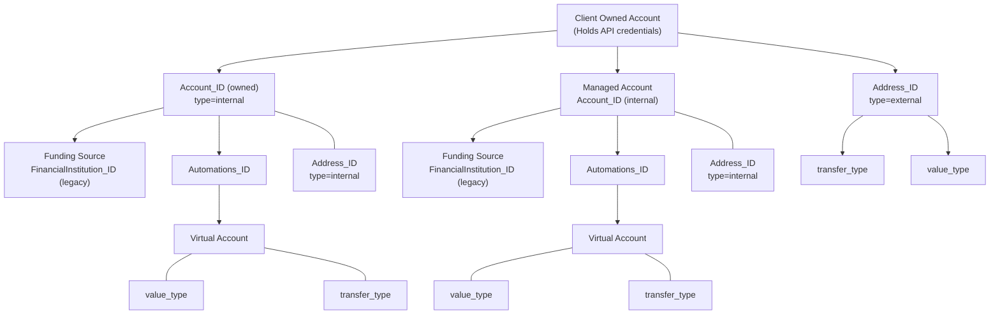

# Brale API structure

How core resources relate to each other when you build on Brale.

## At a glance

- **Client-owned Account** holds your API credentials and owns downstream resources.
- **Managed Accounts** are customer accounts you register under your client account.
- **Addresses** are the canonical source/destination primitive (internal custodial or external).
- **Automations** create virtual receiving accounts that map to underlying addresses.
- **Financial Institutions** are legacy offchain funding records; prefer Addresses. (Shown for backward compatibility.)

## Relationship diagram

## Key points

- All IDs (`account_id`, `address_id`, `automation_id`, etc.) are KSUIDs (26 chars, time-sortable).
- Use `address_id` for all transfer endpoints (onchain and offchain). Financial Institutions are deprecated and retained only for legacy flows.
- Automations produce virtual accounts that resolve to addresses; they surface the `transfer_type` and `value_type` you configure.

### Internal vs. External

- `type=internal` → Brale-custodied resources (accounts you own; addresses Brale holds for you or your managed accounts; automation virtual accounts).
- `type=external` → Counterparty data you register (e.g., recipient bank/wallet addresses).

## Related links

- [Accounts](/key-concepts/accounts)
- [Addresses](/key-concepts/addresses)
- [Automations](/key-concepts/automations)
- [Transfers](/key-concepts/transfers)
- [OpenAPI](https://api.brale.xyz/openapi)