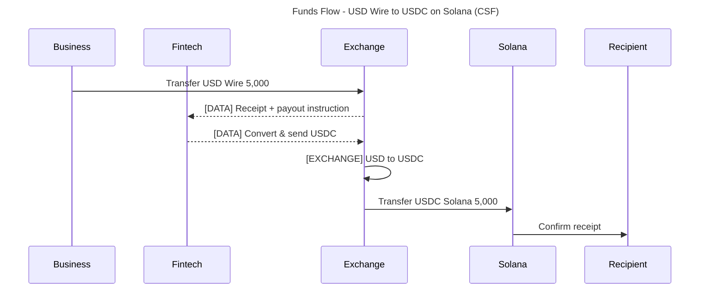

# Commons Stablecoin Format (CSF)

The Commons Stablecoin Format is a lightweight standard for describing value movement across off-chain and on-chain rails. By structuring flows with CSF, you can generate consistent Mermaid sequence diagrams for reviews, runbooks, and customer-facing docs. Learn more in the CSF introduction: [Better Funds Flows](https://benmilne.com/2025/04/13/better-funds-flows/).

## Live CSF JSON

The canonical CSF spec lives in GitHub and updates automatically:

- GitHub file: [csf.json](https://github.com/Brale-xyz/commons/blob/main/Commons%20Stablecoin%20Format/csf.json)
- Raw JSON (auto-updating): [raw.githubusercontent.com/Brale-xyz/commons/.../csf.json](https://raw.githubusercontent.com/Brale-xyz/commons/main/Commons%20Stablecoin%20Format/csf.json)

You can fetch the latest spec in scripts or API tooling, for example:

```bash
curl -s https://raw.githubusercontent.com/Brale-xyz/commons/main/Commons%20Stablecoin%20Format/csf.json | jq .
```

## Kick off with AI

Use this prompt with your LLM after loading the CSF JSON:

> Ingest the Commons Stablecoin Format (CSF) JSON and build a funds flow diagram that follows CSF rules.

- ChatGPT starter (preloads prompt): [Open ChatGPT](https://chat.openai.com/?q=Ingest%20the%20Commons%20Stablecoin%20Format%20(CSF)%20JSON%20and%20build%20a%20funds%20flow%20diagram%20that%20follows%20CSF%20rules.)
- Claude starter: [Open Claude](https://claude.ai/new?q=Ingest%20the%20Commons%20Stablecoin%20Format%20(CSF)%20JSON%20and%20build%20a%20funds%20flow%20diagram%20that%20follows%20CSF%20rules.)

## Why use CSF?

- Consistent labels: every transfer is `ValueType TransferType Amount` (e.g., `USD Wire 5,000`, `USDC Solana 5,000`).
- Clear role separation: participants (e.g., Customer, Exchange, Bank, Blockchain) are explicit in the flow.
- Fast visualization: drop the CSF description into Mermaid to produce diagrams for reviews or implementation guides.

## Quick pattern

1. Define participants (business, platform, exchange, blockchain, recipient).
2. Describe each hop as `ValueType TransferType Amount`.
3. Include exchanges when converting between value types or rails.
4. Render as a Mermaid `sequenceDiagram` for easy sharing.

## Example prompt

Use this prompt with your preferred LLM to produce a CSF Mermaid diagram:

> Create a funds flow for:
> - Off-chain USD wire funding an on-chain USDC payout on Solana
> - Participants: Business, Fintech Platform, Exchange, Solana, Recipient
> - Show the exchange from USD (Wire) to USDC (Solana)
> - Use CSF labeling: `ValueType TransferType Amount`

## Sample Mermaid (CSF style)



## Tips

- Keep flows concise (light), add compliance/finality notes when needed (medium/heavy).
- Reuse the same participant names across flows for comparability.
- Attach these diagrams in implementation guides, runbooks, or customer approvals to align on how value moves.

